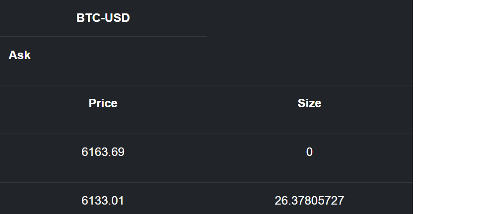

# GDAX Widget
  

This is crypto widget that uses GDAX apis to get the current market price and size for Bitcoin on Coinbase.

<a href="https://cryptowidget.herokuapp.com/">Deployed Link</a>
 
 
## How It Works

Using Gdax public API, I used the websocket endpoint to first get a market snapshot to use as a base for all updates. Once updated data comes through the websocket, use logic to find the corresponding price and or size, and update the current data.
After getting this data from Gdax, Socket IO to handles the communication between the Express server and react client. The client Socket is triggered in the componentDidMount lifecycle, which will set state with any data that comes through the socket. Below is a link to the flow chart that maps this.

https://drive.google.com/file/d/18w6aVHPX9YkTJVPoPLUVY4NttqLSQHt3/view?usp=sharing

## Technologies 

* Node js
* React
* Socket IO
* Express
* Bootstrap
* GDAX 
* Axios